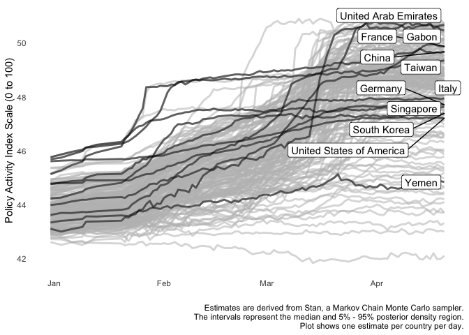

README
================
CoronaNet Project Team
April 24th, 2020

## About This Repository

This repository contains data from the [CoronaNet data collection
project](http://coronanet-project.org) and also data and code to fit the
model described in “A Retrospective Bayesian Model for Measuring
Covariate Effects on Observed COVID-19 Test and Case Counts”, [link
here](https://osf.io/preprints/socarxiv/jp4wk). Following is first a
list of data for the CoronaNet project, with data dictionary, and
subsequently a list of files relevant to “A Retrospective Bayesian Model
for Measuring Covariate Effects on Observed COVID-19 Test and Case
Counts”.

The following plot shows our politcy activity index, a set of scores
produced by a dynamic measurement model from our data. It is also
included in the data release and is a helpful way to reduce the data to
a single score. It also permits more straightforward inter-country
comparisons.

<!-- -->

# CoronaNet Data

First, CoronaNet data releases:

**Please note that while we make every effort to validate this data, the
speed and scale with which it was collected means that we cannot
validate all of it. If you find an error in the data, please file an
issue on this Github page.**

The format of the data is in country-day-`record_id` format. Some
`record_id` values have letters appended to indicate that the general
policy category `type` also has a value for `type_sub_cat`, which
contains more detail about the policy, such as whether health resources
refers to masks, ventilators, or hospitals. Some entries are marked as
`new_entry` in the `entry_type` field for when a policy of that type was
first implemented in the country. Later updates to those policies are
marked as updates in `entry_type`. To see how policies are connected,
look at the `policy_id` field for all policies from the first entry
through updates for a given country/province/city. If an entry was
corrected after initial data collection, it will read corrected in the
`entry_type` field (the original incorrect data has already been
replaced with the corrected data).

1.  **`data/CoronaNet/coronanet_release.csv`** This file contains
    variables from the CoronaNet government response project,
    representing national and sub-national policy event data from more
    than 140 countries since January 1st, 2020. The data include source
    links, descriptions, targets (i.e. other countries), the type and
    level of enforcement, and a comprehensive set of policy types. For
    more detail on this data, you can see our [codebook
    here](https://docs.google.com/document/d/1zvNMpwj0onFvUZ_gLl4RRjqS-clbHv3TIX6EOHofsME).

2.  **`data/CoronaNet/coronanet_release_allvars.csv`** This file
    contains the government response information from
    `coronanet_release.csv` along with the following datasets:
    
    1.  Tests from the CoronaNet testing database (see
        <http://coronanet-project.org> for more info);
    2.  Cases/deaths/recovered from the JHU data repository
        (<https://github.com/CSSEGISandData/COVID-19>);
    3.  Country-level covariates including GDP, V-DEM democracy scores,
        human rights indices, power-sharing indices, and press freedom
        indices from the Niehaus World Economics and Politics Dataverse
        (<https://niehaus.princeton.edu/news/world-economics-and-politics-dataverse>)

## `coronanet_release.csv` Field Dictionary

1.  `record_id` Unique identifier for each unique policy record
2.  `policy_id` Identifier linking new policies with subsequent updates
    to policies
3.  `recorded_date` When the record was entered into our data
4.  `date_announced` When the policy is announced
5.  `date_start` When the policy goes into effect
6.  `date_end` When the policy ends (if it has an explicit end date)
7.  `entry_type` Whether the record is new, meaning no restriction had
    been in place before, or an update (restriction was in place but
    changed). Corrections are corrections to previous entries.
8.  `event_description` A short description of the policy change
9.  `domestic_policy` Indicates where policy targets an area within the
    initiating country (i.e. is domestic in nature)
10. `type` The category of the policy
11. `type_sub_cat` The sub-category of the policy (if one exists)
12. `type_text` Any additional information about the policy type (such
    as the number of ventilators/days of quarantine/etc.)
13. `index_high_est` The high (95% posterior density) estimate of the
    country policy activity score (0-100)
14. `index_med_est` The median (most likely) estimate of the country
    policy activity score (0-100)
15. `index_low_est` The low (95% posterior density) estimate of the
    country policy activity score (0-100)
16. `index_country_rank` The relative rank by each day for each country
    on the policy activity score
17. `country` The country initiating the policy
18. `init_country_level` Whether the policy came from the national level
    or a sub-national unit
19. `province` Name of sub-national unit
20. `target_country` Which foreign country a policy is targeted at
    (i.e. travel policies)
21. `target_geog_level` Whether the target of the policy is a country as
    a whole or a sub-national unit of that country
22. `target_region` The name of a regional grouping (like ASEAN) that is
    a target of the policy (if any)
23. `target_province` The name of a province targeted by the policy (if
    any)
24. `target_city` The name of a city targeted by the policy (if any)
25. `target_other` Any geographical entity that does not fit into the
    targeted categories mentioned above
26. `target_who_what` Who the policy is targeted at
27. `target_direction` Whether a travel-related policy affects people
    coming in (Inbound) or leaving (Outbound)
28. `travel_mechanism` If a travel policy, what kind of transportation
    it affects
29. `compliance` Whether the policy is voluntary or mandatory
30. `enforcer` What unit in the country is responsible for enforcement
31. `link` A link to at least one source for the policy
32. `ISO_A3` 3-digit ISO country codes
33. `ISO_A2` 2-digit ISO country codes
    <!-- 22. `severity_index_5perc` 5% posterior low estimate (i.e. lower bound of uncertainty interval) for severity index -->
    <!-- 23. `severity_index_median` posterior median estimate (point estimate) for severity index, which comes from a Bayesian latent variable model aggregating across policy types to measure country-level policy severity (see paper on our website) -->
    <!-- 24. `severity_index_5perc` 95% posterior high estimate (i.e. upper bound of uncertainty interval) for severity index -->

## `coronanet_release_allvars.csv` Field Dictionary

1.  All of the fields listed above, plus

2.  `tests_daily_or_total` Whether a country reports the daily count of
    tests a cumulative total

3.  `tests_raw` The number of reported tests collected from host country
    websites or media reports

4.  `deaths` The number of COVID-19 deaths, aggregated to the
    country-day level (JHU CSSE data)

5.  `confirmed_cases` The number of confirmed cases of COVID-19,
    aggregated to the country-day level (JHU CSSE data)

6.  `recovered` The number of recoveries from COVID-19, aggregated to
    the country-day level (JHU CSSE data)

7.  `ccode` The Correlates of War country code

8.  `ifs` IMF IFS country code

9.  `Rank_FP` (most recent year available from Niehaus dataset)
    Reporters without Borders Press Freedom Annual Ranking

10. `Score_FP` (most recent year available from Niehaus dataset)
    Reporters with Borders Press Freedom Score

11. `state_IDC` (most recent year available from Niehaus dataset)
    State/Provincial Governments Locally Elected

12. `muni_IDC` (most recent year available from Niehaus dataset)
    Municipal Governments Locally Elected

13. `dispersive_IDC` (most recent year available from Niehaus dataset)
    Dispersive Powersharing

14. `constraining_IDC` (most recent year available from Niehaus dataset)
    Constraining Powersharing

15. `inclusive_IDC` (most recent year available from Niehaus dataset)
    Inclusive powersharing

16. `sfi_SFI` (most recent year available from Niehaus dataset) State
    fragility index

17. `ti_cpi_TI` (most recent year available from Niehaus dataset)
    Corruption perceptions index

18. `pop_WDI_PW` (most recent year available from Niehaus dataset) World
    Bank population

19. `gdp_WDI_PW` (most recent year available from Niehaus dataset) World
    Bank GDP (total)

20. `gdppc_WDI_PW` (most recent year available from Niehaus dataset)
    World Bank GDP per capita

21. `growth_WDI_PW` (most recent year available from Niehaus dataset)
    World Bank GDP growth percent

22. `lnpop_WDI_PW` (most recent year available from Niehaus dataset) Log
    of World Bank population

23. `lngdp_WDI_PW` (most recent year available from Niehaus dataset) Log
    of World Bank GDP

24. `lngdppc_WDI_PW` (most recent year available from Niehaus dataset)
    Log of World Bank GDP per capita

25. `disap_FA` (most recent year available from Niehaus dataset) 3
    category, ordered variable for disappearances index

26. `polpris_FA` (most recent year available from Niehaus dataset) 3
    category, ordered variable for political imprisonment index

27. `latentmean_FA` (most recent year available from Niehaus dataset)
    the posterior mean of the latent variable index for human rights
    protection)

28. `transparencyindex_HR` (most recent year available from Niehaus
    dataset) Transparency Index

29. `EmigrantStock_EMS` (most recent year available from Niehaus
    dataset) Total emmigrant stock from

30. `v2x_polyarchy_VDEM` (most recent year available from Niehaus
    dataset) Electoral democracy index

31. `news_WB` (most recent year available from Niehaus dataset) Daily
    newspapers (per 1,000
people)

# A Retrospective Bayesian Model for Measuring Covariate Effects Data and Code

Files to reproduce the paper:

1.  **`retrospective_model_paper/corona_tscs_betab.stan`**: This Stan
    model contains a partially-identified model of COVID-19 that permits
    relative distinctions to be made between areas/countries/states’
    infection rates. The parameter `num_infected_high` indexes the
    infection rate by time point and country. As the latent process is
    on the logit scale, it must be converted via the inverse-logit
    function to a proportion. However, the resulting estimate should not
    be interpreted as the total infected in a country, but rather a
    relative ranking of which countries/areas are the most infected up
    to the current time point.

2.  **`retrospective_model_paper/corona_tscs_betab_scale.stan`**: This
    Stan model extends the partially-identified model with the 10% lower
    threshold for tests to infections ratio described in the paper. This
    model will produce an estimate for `num_infected_high` that when
    converted with the inverse-logit function will represent the
    proportion infected in a country conditional on the model’s prior
    concerning the tests to infections ratio.

3.  **`retrospective_model_paper/kubinec_model_preprint.Rmd`**: A copy
    of the paper draft with embedded R code. You can access fitted Stan
    model objects to compile the paper here:
    <https://drive.google.com/open?id=1cTCQTAjH8I-11jp3CEdIJZ0NaGRAn8dT>.
    Otherwise all Stan models must be re-fit to compile the paper. The
    process will take approximately 2 hours.

4.  **`retrospective_model_paper/kubinec_model_SI.Rmd`**: This file
    contains an Rmarkdown file with embedded R code showing how to
    simulate the model. It is the supplementary information for the
    paper. See the compiled .pdf version as well.

5.  **`data`**: The data folder contains CSVs of tests and cases for US
    states and other data that were used to fit the models in the paper.

6.  **`retrospective_model_paper/BibTexDatabase.bib`**: This file
    contains the Bibtex bibliography for the paper.
